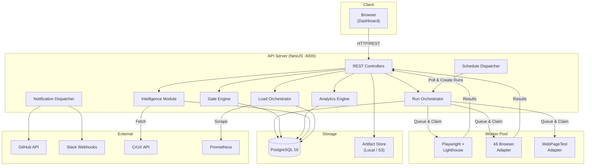
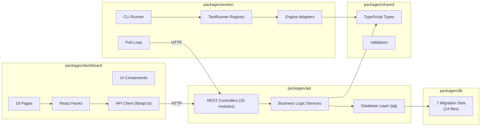
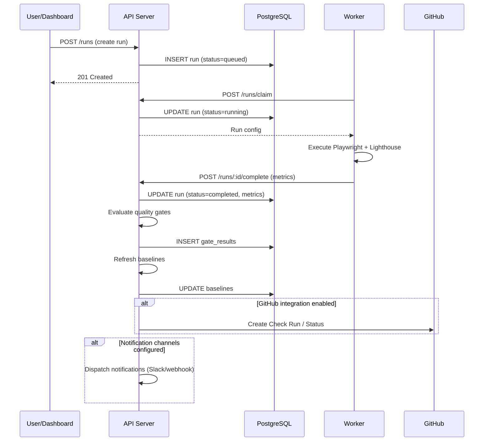
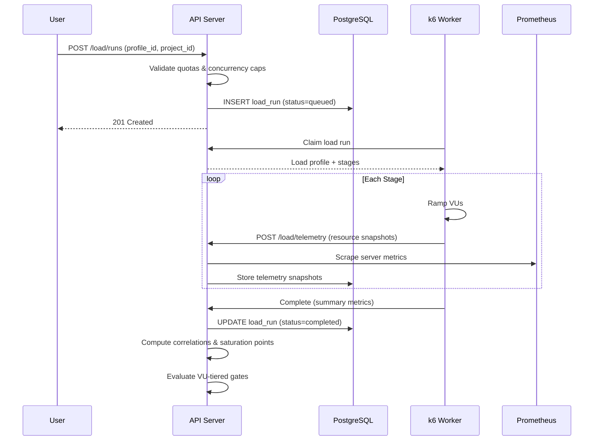
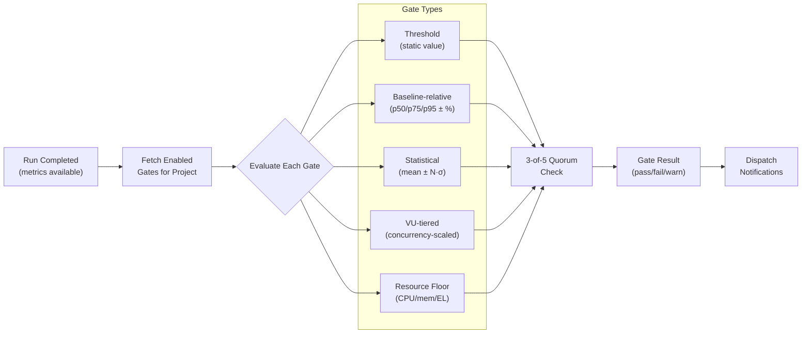
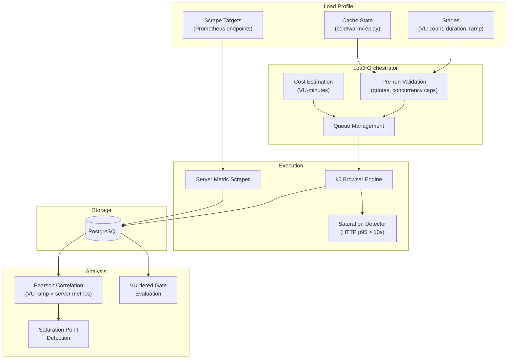
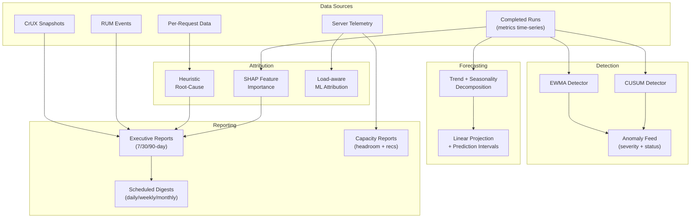
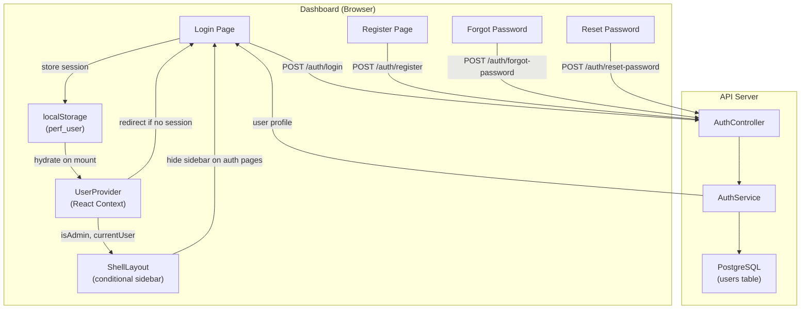
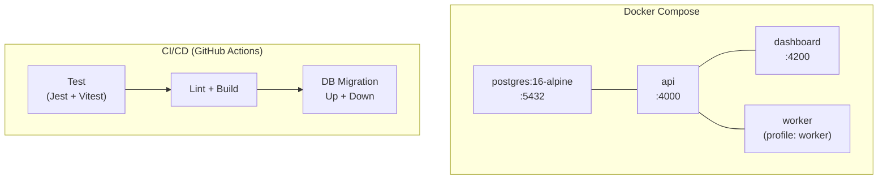

# Architecture — UI Performance Testing & Analysis Framework

This document describes the system architecture, component interactions, data flow, and design decisions.

---

## Table of Contents

1. [System Overview](#system-overview)
2. [High-Level Architecture](#high-level-architecture)
3. [Component Diagram](#component-diagram)
4. [Data Flow](#data-flow)
5. [Package Structure](#package-structure)
6. [API Server (NestJS)](#api-server-nestjs)
7. [Dashboard (Next.js)](#dashboard-nextjs)
8. [Worker Engine](#worker-engine)
9. [Database Schema](#database-schema)
10. [Quality Gate Pipeline](#quality-gate-pipeline)
11. [Load Testing Architecture](#load-testing-architecture)
12. [Intelligence Pipeline](#intelligence-pipeline)
13. [Authentication & RBAC](#authentication--rbac)
14. [Deployment Architecture](#deployment-architecture)

---

## System Overview

The framework is a **monorepo** with five packages that form a distributed system:

```
┌─────────────────────────────────────────────────────────────────┐
│                        Monorepo (npm workspaces)                │
│                                                                 │
│  ┌──────────┐  ┌──────────┐  ┌──────────┐  ┌────┐  ┌────────┐ │
│  │   API    │  │Dashboard │  │  Worker  │  │ DB │  │ Shared │ │
│  │ (NestJS) │  │(Next.js) │  │(Playwright│  │    │  │ Types  │ │
│  │ :4000   │  │  :4200   │  │+Lighthouse│  │    │  │        │ │
│  └──────────┘  └──────────┘  └──────────┘  └────┘  └────────┘ │
└─────────────────────────────────────────────────────────────────┘
```

---

## High-Level Architecture



---

## Component Diagram



---

## Data Flow

### Synthetic Test Run



### Load Test Run



---

## Package Structure

### `packages/api` — NestJS REST API

```
src/
├── main.ts                  Application entry point
├── app.module.ts            Root module (26 feature modules)
├── health.controller.ts     Health check endpoint
│
├── projects/                Project CRUD
├── scripts/                 Script CRUD + versioning
├── runs/                    Run orchestration + claim/complete
├── gates/                   Gate CRUD + evaluation engine
├── schedules/               Schedule CRUD + dispatcher
├── baselines/               Statistical baseline computation
├── trends/                  Time-series metrics API
│
├── analytics/               Change-point detection, anomalies, attribution
├── authoring/               NL test authoring pipeline
├── intelligence/            SHAP, forecasting, RUM, CrUX, capacity, audit, API keys, geo
├── reports/                 Executive report generation
│
├── load/                    Load profiles, runs, telemetry, correlation, VU gates
├── per-request/             Per-request metrics storage
│
├── rbac/                    Users, roles, project membership
├── auth/                    Register, login, password management
├── notifications/           Slack, webhook, email channels
├── github/                  GitHub Check Runs + commit statuses
├── artifacts/               Artifact storage (local/S3)
├── environments/            Environment configuration
├── database/                Database connection + pool
├── bugs/                    Bug tracking integration
└── integration/             Integration test utilities
```

### `packages/dashboard` — Next.js Web App

```
src/
├── app/
│   ├── page.tsx             Dashboard home (CWV, stats, recent runs)
│   ├── layout.tsx           Root layout (Sidebar + Providers)
│   ├── runs/                Run list + detail pages
│   ├── scripts/             Script list + detail pages
│   ├── gates/               Gate management
│   ├── schedules/           Schedule management
│   ├── trends/              Metric time-series charts
│   ├── results/             Run results detail
│   ├── compare/             Side-by-side comparison
│   ├── anomalies/           Anomaly feed
│   ├── intelligence/        ML attribution, forecasting, RUM, CrUX, capacity
│   ├── reports/             Executive reports
│   ├── load/                Load testing dashboard
│   ├── author/              NL test authoring
│   ├── knowledge/           Knowledge base
│   ├── users/               User management (admin-only)
│   ├── settings/            Project, channel, environment, profile settings
│   ├── login/               Login page
│   ├── register/            Registration page
│   ├── forgot-password/     Password recovery
│   └── reset-password/      Password reset
│
├── components/
│   ├── sidebar.tsx          Navigation sidebar with user switcher + logout
│   ├── providers.tsx        QueryClient + UserProvider wrapper
│   ├── user-provider.tsx    User context with RBAC state
│   ├── metric-tooltip.tsx   Web Vitals tooltip component
│   └── metric-relationship-diagram.tsx
│
├── hooks/
│   ├── use-current-user.ts  User context hook + interface
│   ├── use-projects.ts      Project list hook
│   └── use-user-projects.ts Accessible projects (RBAC-filtered)
│
├── lib/
│   └── api.ts               API client with typed endpoints
│
└── __tests__/               6 test suites (Vitest)
```

### `packages/worker` — Test Execution Engine

```
src/
├── cli.ts                   CLI entry point (--url, --script, --device)
├── poll-loop.ts             Worker poll loop (claim → execute → report)
│
└── engine/
    ├── test-runner.ts        Pluggable engine registry
    ├── types.ts              Shared engine types
    ├── playwright-lighthouse-runner.ts   Core Playwright + Lighthouse runner
    ├── metrics-collector.ts  Metric extraction and normalization
    ├── stats.ts              Statistical utilities (mean, stddev, percentiles)
    ├── index.ts              Engine barrel export
    │
    ├── adapters/
    │   ├── playwright-adapter.ts    Playwright adapter (built-in)
    │   ├── k6-browser-adapter.ts    k6 browser module adapter
    │   ├── wpt-adapter.ts           WebPageTest adapter
    │   └── sitespeed-adapter.ts     sitespeed.io placeholder
    │
    └── __tests__/            Unit tests (Vitest)
```

### `packages/db` — Database Migrations

```
migrations/
├── 001_initial_schema        Projects, scripts, runs, baselines, gates, artifacts, audit
├── 002_phase1_schedules      Schedules with cron + next_run_at
├── 003_phase2_rbac_notif     Users, roles, project members, notification channels
├── 004_phase3_intelligence   Anomalies, per-request data, reports, authoring logs
├── 005_phase35_load          Load profiles, load runs, telemetry, load gates
├── 006_phase4_ga_scale       RUM events, CrUX snapshots, API keys, audit log, forecasts
└── 007_auth_password         Password hashing fields
```

---

## Quality Gate Pipeline



---

## Load Testing Architecture



---

## Intelligence Pipeline



---

## Authentication & RBAC

### Auth Flow



### Session Management

1. **Login** → API returns `{id, email, display_name, role}` → stored in `localStorage`
2. **App mount** → `UserProvider` reads `localStorage`, sets `currentUser` in React context
3. **Route guard** → unauthenticated users on non-auth pages are redirected to `/login`
4. **Auth pages** → `ShellLayout` hides the sidebar on `/login`, `/register`, `/forgot-password`, `/reset-password`
5. **Session sync** → when the API returns updated user data (e.g., role changed by admin), `localStorage` is auto-refreshed
6. **Logout** → clears `localStorage`, clears React Query cache, redirects to `/login`

### Password Hashing

- Algorithm: `scryptSync` (Node.js `crypto`)
- Salt: 32 random bytes (hex-encoded)
- Key length: 64 bytes
- Storage format: `{salt_hex}:{hash_hex}` in `password_hash` column
- Reset tokens: 32 random bytes (hex), 1-hour expiry

### Seed Data

`npm run db:seed` creates demo users via `packages/db/seed.mjs` using the same hashing algorithm as the API. Passwords are pre-hashed and inserted with `ON CONFLICT ... DO UPDATE` for idempotency.

### User Model

```
users table:
  id              UUID PRIMARY KEY
  email           TEXT UNIQUE NOT NULL
  display_name    TEXT
  role            TEXT ('admin' | 'editor' | 'viewer')
  password_hash   TEXT
  reset_token     TEXT
  reset_token_expires TIMESTAMPTZ
  is_active       BOOLEAN DEFAULT true
  created_at      TIMESTAMPTZ
```

### Roles & Permissions

| Feature | Admin | Editor | Viewer |
|---------|-------|--------|--------|
| Login / register / reset password | ✅ | ✅ | ✅ |
| View dashboards & results | ✅ | ✅ | ✅ |
| Create/run scripts & tests | ✅ | ✅ | ❌ |
| Users page & manage users | ✅ | ❌ | ❌ |
| Create/delete projects & channels | ✅ | ❌ | ❌ |
| Switch user (impersonate) | ✅ | ❌ | ❌ |
| Change own password & profile | ✅ | ✅ | ✅ |

---

## Deployment Architecture



### Service Configuration

| Service | Port | Base Image | Dependencies |
|---------|------|------------|-------------|
| PostgreSQL | 5432 | `postgres:16-alpine` | — |
| API Server | 4000 | Node.js 20 | PostgreSQL |
| Dashboard | 4200 | Node.js 20 | API Server |
| Worker | — | Node.js 20 + Chromium | API Server |

### Health Checks

- **PostgreSQL**: `pg_isready -U perf -d perf_framework` (5s interval)
- **API**: `GET /api/v1/health`

---

## Design Decisions

### Why monorepo?

- Shared TypeScript types between API, dashboard, and worker
- Atomic commits across packages
- Unified CI pipeline
- npm workspaces for zero-config dependency management

### Why PostgreSQL for everything?

- Single operational dependency for MVP/development
- JSONB columns for flexible metric and config storage
- Per-request schema designed with ClickHouse migration path (cardinality-controlled aggregation)
- Full ACID compliance for gate evaluation and audit logging

### Why poll-based workers?

- No message broker dependency (Redis, RabbitMQ)
- Workers claim runs via `POST /runs/claim` with atomic status transition
- Scales horizontally by adding workers
- Timeout enforcement on the API side (configurable max run duration)

### Why 3-of-5 quorum for gates?

- Single-run variance in Lighthouse scores can be ±5-10%
- Quorum prevents a single flaky measurement from blocking CI
- Configurable per gate (can be adjusted or disabled)

---

## Metrics Collected

### Per Synthetic Run

| Category | Metrics |
|----------|---------|
| **Core Web Vitals** | LCP (ms), FCP (ms), INP (ms), CLS, TTFB (ms), TBT (ms) |
| **Lighthouse Scores** | Performance, Accessibility, Best Practices, SEO (0-1) |
| **Timing** | DOM Content Loaded, Load Event, Speed Index |
| **Resources** | Total requests, transfer size, resource breakdown |

### Per Load Run

| Category | Metrics |
|----------|---------|
| **VU Metrics** | Active VUs, iteration rate, HTTP request rate |
| **Latency** | Response time p50/p95/p99 |
| **Server** | CPU %, memory %, disk I/O, network, event loop lag |
| **Saturation** | HTTP p95 latency, iteration throughput |

---

## Further Reading

- [User Guide](USER_GUIDE.md) — Day-to-day usage
- [Contributing](CONTRIBUTING.md) — Development workflow
- [README](../README.md) — Quick start and API reference
